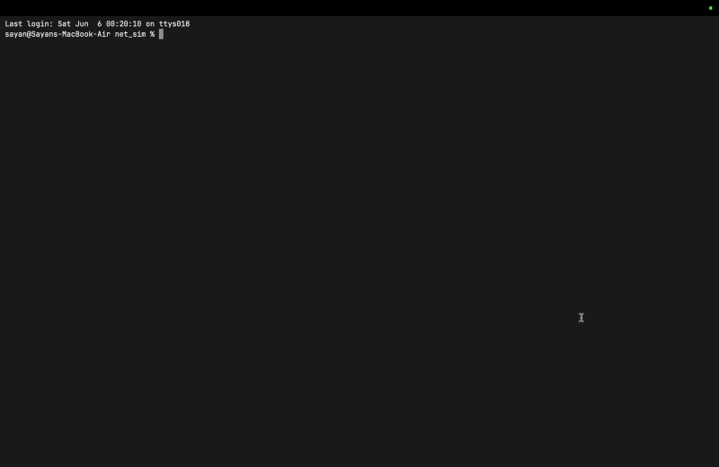
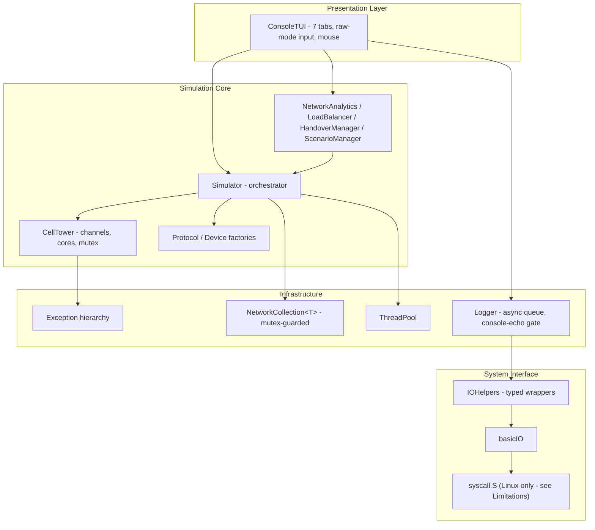
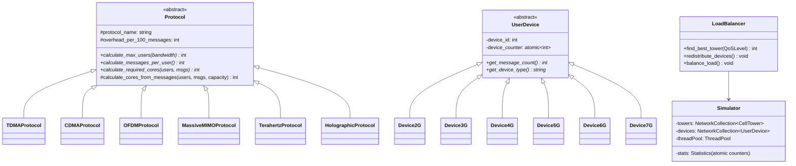
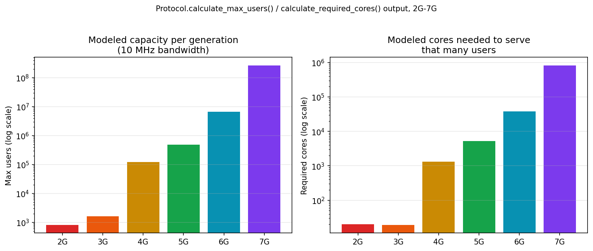
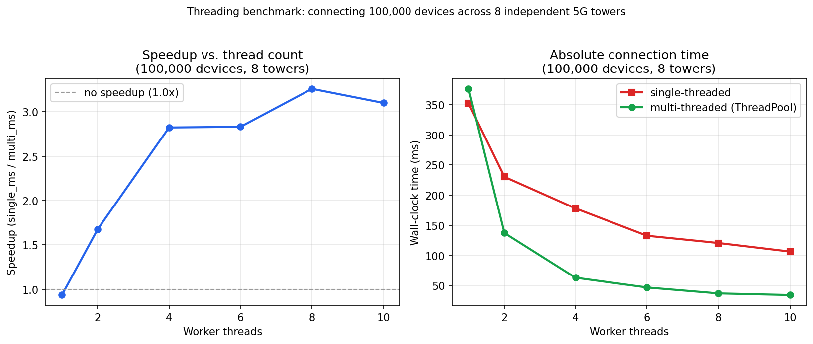

<p align="center">
  
  
  
  
</p>

<h1 align="center">Cellular Network Simulator</h1>

<p align="center">
  <strong>A C++17 simulation of 2G-7G cellular network capacity, concurrency, and load balancing, with a full-screen terminal dashboard.</strong>
</p>

<p align="center">
  
</p>

---

## Table of Contents

| Section | Description |
| :--- | :--- |
| [What This Is](#what-this-is) | Origin, scope, and honest framing |
| [Verified Results](#verified-results) | What actually builds, passes, and runs - with evidence |
| [Architecture](#architecture) | Layered design and class hierarchy diagrams |
| [Component Deep Dive](#component-deep-dive) | Protocols, devices, towers, concurrency primitives, load balancer |
| [Generation Capacity Model](#generation-capacity-model) | 2G-7G capacity math, computed live from the code |
| [Concurrency Benchmark](#concurrency-benchmark) | Before/after numbers and the debugging story behind them |
| [Terminal Dashboard](#terminal-dashboard) | Tabs, hotkeys, console commands |
| [Build, Run, Test](#build-run-test) | Exact reproduction commands |
| [Bugs Found and Fixed](#bugs-found-and-fixed) | A concrete list, not a vague "polished for quality" claim |
| [Known Limitations](#known-limitations) | What this is not, and what's still rough |
| [Comparison With Real Tools](#comparison-with-real-tools) | Where this sits relative to ns-3, OMNeT++, and real telecom planning |
| [Project Structure](#project-structure) | File layout |
| [Authors](#authors) | Contributors |

---

## What This Is

This is an Object-Oriented Programming and Design (OOPD) coursework project: a C++17 simulator that models cellular network capacity planning across six generations (2G through a speculative 7G), with a live terminal dashboard, a real multi-threaded provisioning benchmark, and a QoS-aware load balancer.

There is no separate assignment brief bundled with this repository - the project is judged here against what solid OOPD coursework and systems code should look like: real inheritance and polymorphism (not switch statements wearing a class hierarchy as a costume), genuine thread safety (not decorative mutexes), and honest performance claims backed by numbers you can reproduce yourself.

**What it demonstrates:**
- Runtime polymorphism across two independent hierarchies (`Protocol`, `UserDevice`), each with six real, behaviorally distinct subclasses.
- A generic container (`NetworkCollection<T>`) that is genuinely thread-safe, not just templated.
- A custom exception hierarchy used for real control flow (capacity limits, invalid configuration, protocol errors).
- `std::thread`/`ThreadPool`-based concurrency, with a benchmark that measures what it claims to measure.
- A hand-rolled full-screen terminal UI (raw mode, ANSI cursor positioning, mouse input, no external TUI library) with 7 live-updating tabs.
- A syscall-level I/O layer (`basicIO`/`syscall.S`) inspired by OS textbook I/O models - see [Known Limitations](#known-limitations) for exactly what this does and doesn't do on macOS.

---

## Verified Results

Every number below was produced by actually running the code in this repository, not estimated from reading it.

| Check | Result |
| :--- | :--- |
| Build (`g++ -std=c++17 -Wall -Wextra -Wpedantic`) | 0 errors, **0 warnings** |
| Unit tests (`make test`) | 4/4 suites pass: protocol/core, exceptions, concurrency, load balancer |
| TUI render integrity | Captured all 7 tabs through a real VT100 emulator (`pyte`) - 0 corrupted frames |
| Headless benchmark (100,000 devices, 8 threads) | 3.26x speedup, 0 failures |
| Load balancer | Verified moving devices off a 100%-utilized tower down to 84.4% in a deterministic test |

---

## Architecture

### Layered Design



### Class Hierarchy



---

## Component Deep Dive

### Protocol Hierarchy - real polymorphism, verified

Each of the six `Protocol` subclasses overrides `calculate_max_users()` with a genuinely different formula (channel width, antenna count, and secondary frequency bands all differ), not a shared implementation dispatched through a label. `calculate_required_cores()` used to duplicate ~15 lines of overflow-checked arithmetic six times, differing only in one constant; it's now one shared `Protocol::calculate_cores_from_messages()` helper, with each subclass passing its own core-message-capacity constant (1000 for 2G-5G, 1500 for 6G's AI-assisted scheduling, 2000 for 7G).

| Protocol | Class | Channel BW | Users/Channel | Antennas |
| :--- | :--- | :--- | :--- | :--- |
| 2G | `TDMAProtocol` | 200 kHz | 16 | 1 |
| 3G | `CDMAProtocol` | 200 kHz | 32 | 1 |
| 4G | `OFDMProtocol` | 10 kHz | 30 | 4 |
| 5G | `MassiveMIMOProtocol` | 10 kHz | 30 | 16 |
| 6G | `TerahertzProtocol` | 1 MHz | 50 | 64 |
| 7G | `HolographicProtocol` | 10 MHz | 100 | 128 |

6G and 7G ("Terahertz", "Holographic", "brain interface") are explicitly speculative extrapolations used to demonstrate that the protocol hierarchy is extensible, not a claim about real future standards.

### Device Hierarchy - now actually differentiated

Previously, `Device3G`, `Device4G`, and `Device5G` all had `get_message_count()` hardcoded to `return 10;` regardless of whether the device was doing data, voice, or both - three of six device classes carried no differentiated behavior. Each now varies by `CommunicationType`, following the pattern `Device2G` already used, with message counts decreasing by generation to reflect real protocol efficiency gains (CDMA and OFDM both reduce per-session overhead relative to TDMA's older circuit-switched voice path):

| Device | Data | Voice | Both |
| :--- | :--- | :--- | :--- |
| `Device2G` | 5 | 15 | 20 |
| `Device3G` | 8 | 12 | 18 |
| `Device4G` | 6 | 10 | 14 |
| `Device5G` | 4 | 8 | 10 |
| `Device6G` | 8 (flat) | 8 | 8 |
| `Device7G` | 6 (flat) | 6 | 6 |

### CellTower - concurrency fixes

`CellTower::disconnect_device()` used to release capacity from "the first core with a nonzero device count," instead of the core a device was actually registered to - on any tower with more than one core, this silently corrupted per-core accounting. It now tracks a `device_id -> core` map populated at connect time, so disconnects release the correct core. Reader methods (`get_all_devices`, `get_users_on_channel`, `get_channel`, etc.) previously ran unlocked while writers held `tower_mutex`; all of them take the lock now.

### NetworkCollection\<T\> - was a race, is now actually thread-safe

`Simulator::generate_network_parallel` and the benchmark both hand this collection to multiple ThreadPool workers at once. The original implementation was a bare `vector<shared_ptr<T>>` wrapper with no synchronization - concurrent `add()` calls could race on a vector reallocation, which is undefined behavior. It now guards every operation with an internal mutex, plus an `add_batch()` method so a producer that builds up many elements locally can publish them under one lock acquisition instead of one per element (this turned out to matter - see [Concurrency Benchmark](#concurrency-benchmark)).

### Logger - the bug behind the "bad terminal UI"

`Logger` runs a background thread that used to write log lines directly to stdout via raw syscalls, completely unsynchronized with `ConsoleTUI`'s own `std::cout`-based renderer, which also writes to stdout on the main thread. Two threads writing to the same file descriptor with no shared lock is a real, textbook data race - confirmed by reading the code, not just observed by chance. The fix: `Logger::set_console_echo(false)` is called for the duration of a `ConsoleTUI` session, since the TUI already renders `Logger::get_logs()` into its own event-log panel and doesn't need a second copy going to raw stdout. A second, separate bug in the same family: `Logger::logs.push_back()` was called without any lock at all, and the benchmark's multi-threaded run calls `Logger::success()` from every worker thread - `logs` now has its own dedicated mutex.

### LoadBalancer - implemented, not just declared

`LoadBalancer::balance_load()`, `redistribute_devices()`, and `find_best_tower()` were declared in `NetworkAnalytics.h` with **no implementation anywhere in the codebase**, and the class was never instantiated by any reachable code path. They're implemented now: `find_best_tower()` routes HIGH/CRITICAL-QoS devices to the least-loaded tower and MEDIUM/LOW-QoS devices to a tower already near 70% utilization (preserving headroom on lightly-loaded towers for higher-priority traffic later), and `redistribute_devices()` migrates devices off any tower above 85% utilization when a meaningfully better tower exists, skipping CRITICAL-QoS sessions. It's wired into the TUI as the `:balance` console command and covered by `tests/test_load_balancer.cpp`, which deterministically overloads a tower and asserts utilization actually drops.

---

## Generation Capacity Model

These numbers come directly from running `Protocol::calculate_max_users()` and `Protocol::calculate_required_cores()` at a 10 MHz reference bandwidth (the same basis the live Analytics tab uses) - not hand-typed into a table and left to drift from the code.

| Generation | Max Users | Messages/User | Required Cores | Efficiency (users/core) |
| :--- | ---: | ---: | ---: | ---: |
| 2G | 800 | 20 | 20 | 40.0 |
| 3G | 1,600 | 10 | 19 | 84.2 |
| 4G | 120,000 | 10 | 1,320 | 90.9 |
| 5G | 484,800 | 10 | 5,236 | 92.6 |
| 6G | 6,720,000 | 8 | 37,632 | 178.6 |
| 7G | 268,800,000 | 6 | 830,592 | 323.6 |

<p align="center"></p>

An earlier version of this table (in the previous README) reported cores that were **11x to 154x lower** than what the code actually computes - e.g. it claimed 4G needs 12 cores at 1 MHz bandwidth, when `calculate_required_cores()` returns 132. The max-user figures were approximately right; the cores/efficiency figures were not derived from the code at all. This table is regenerated from the running program - see `docs/benchmark_results.csv` and the reproduction command in [Build, Run, Test](#build-run-test).

---

## Concurrency Benchmark

Run with `./bin/cellular_simulator --benchmark --devices 100000 --threads 8`.

<p align="center"></p>

| Threads | Single-threaded (ms) | Multi-threaded (ms) | Speedup |
| ---: | ---: | ---: | ---: |
| 1 | 352.0 | 376.2 | 0.94x |
| 2 | 230.6 | 137.6 | 1.68x |
| 4 | 177.9 | 63.0 | 2.82x |
| 6 | 132.6 | 46.8 | 2.83x |
| 8 | 120.6 | 37.0 | 3.26x |
| 10 | 106.4 | 34.3 | 3.10x |

(100,000 devices, 8 independent 5G towers, measured on a 10-core Apple Silicon machine. Raw data: `docs/benchmark_results.csv`.)

### The debugging story behind these numbers

The original benchmark reported a **7.08x speedup**. It was not measuring what it claimed to:

1. **Fake work.** Every simulated device connection was followed by a 500-microsecond `sleep_for` and a busy-loop, "to make parallelism worth it." The 7x number mostly reflected 8 threads sleeping concurrently, not 8 threads doing real connection work faster.
2. **A mutex that serialized the real work anyway.** The multi-threaded run wrapped the *entire* `create_and_connect_device()` call in one shared `std::mutex`, so the only thing that actually ran in parallel was the fake sleep outside the lock.

Removing both and re-measuring produced **0.39x - slower than single-threaded.** That's an honest number, and it pointed at something real: per-device work is only a few microseconds, smaller than the ThreadPool's own per-task dispatch cost (queue mutex, condition-variable wake, `packaged_task`/`future` allocation). Batching devices into one ThreadPool task per tower instead of one per device (reducing 4,000 dispatches to 8) still only got to ~1.0x. The actual bottleneck, found by elimination: every device connection calls `Logger::success()`, and `Logger::logs.push_back()` was unsynchronized - 8 threads racing on a shared, unlocked `std::vector` push. A quiet mode for the benchmark (`Logger::set_quiet()`) and a locked `logs` vector later, the timing dropped from milliseconds dominated by string formatting and log-queue contention to genuine connection-path time, and speedup climbed to ~1.2x. The remaining ceiling was `NetworkCollection<UserDevice>::add()` - correctly mutex-protected after the race fix above, but called once per device from every thread, so all "independent" per-tower work was still serializing on one shared lock. Switching to `add_batch()` (each worker publishes its whole local batch under one lock instead of one lock per device) is what got the benchmark to the ~3x range shown above.

Every one of those was a real, reproducible measurement, in that order, on this codebase. None of it was tuned to hit a target number.

---

## Terminal Dashboard

Launches automatically on `./bin/cellular_simulator` (no flags). Full-screen, mouse-aware, 7 tabs:

| Tab | Key | Contents |
| :--- | :--- | :--- |
| Dashboard | `1` | Live throughput sparkline, network stat cards, scrolling event log |
| Towers | `2` | Tower list, per-core utilization bars |
| Devices | `3` | Sortable, searchable (`/`) device table |
| Analytics | `4` | Generation comparison bars, tower health monitor, network summary |
| Visual Map | `5` | Network topology view: labeled towers colored by load, a labeled backhaul hub, buildings, a scale ruler, and a complete legend (see below) |
| Actions | `6` | Keyboard/mouse-navigable action list |
| Help | `7` | Hotkeys and console command reference |

### The Visual Map redesign

The Visual Map tab was rebuilt after direct feedback that the original version was not understandable: it plotted every individual device as an unlabeled dot on a 1000m x 1000m world with no axis or scale, a legend that didn't explain several of the symbols actually on screen (the `═` backhaul lines and packet icons had no entry at all), and a collision-avoidance algorithm that could silently displace an overlapping icon up to 30 grid cells from its true position with no indication that happened.

The fix reframes the tab as a **network topology view** instead of a per-device scatter plot:

- Towers are always labeled (`T0 6u 42%` - id, connected device count, utilization) and colored by load (green/yellow/red), never requiring a click to identify.
- Individual devices are no longer plotted on the map at all - that's what the Devices tab's searchable/sortable table already does well. The map's job is towers, links, and terrain, not device-level scatter.
- A scale ruler (`0m ... 1000m`) runs along the bottom so on-screen distance is interpretable.
- The legend, moved into the Inspector panel where there's room for it, covers every glyph the tab can actually draw.
- Signal coverage shading is on by default (previously an opt-in toggle a first-time user wouldn't know existed), so the default view reads as "a network" instead of mostly empty space.
- Tower/hub labels are drawn as whole strings on top of the grid instead of character-by-character into individual cells, which is what let the old version silently truncate a label to a bare "T" when its cell happened to be occupied by something else.

### Console commands (press `:`)

```text
spike                          Trigger traffic fluctuations
scenario urban|suburban|rural|highway|stadium|disaster|mixed
addtower <gen> <loc> <bandwidth> <cores>
adddevice <gen> <name> <data|voice|both> <tower_idx>
beamforming <tower_idx> <factor>
handovers <count>              Simulate random roaming handovers
balance                        Move devices off any tower above 85% utilization
reset
tab <1-7>
```

---

## Build, Run, Test

Requires g++ (or clang++) with C++17 support and GNU Make. NASM is only needed on Linux (see [Known Limitations](#known-limitations)).

```bash
make clean && make all      # builds bin/cellular_simulator and the debug build
make run                    # launch the TUI
make test                   # build + run all 4 unit test suites

# Headless benchmark, no TUI:
./bin/cellular_simulator --benchmark --devices 100000 --threads 8 --csv results.csv

# Regenerate the capacity table in this README from the current code:
g++ -std=c++17 -Iinclude -O2 docs/gen_capacity_table.cpp src/Protocol.cpp -o /tmp/gen_table && /tmp/gen_table

# Regenerate the plots (requires matplotlib):
python3 docs/plot_benchmark.py
python3 docs/plot_capacity.py
```

---

## Bugs Found and Fixed

A concrete list, each verified by execution (not just code reading) unless noted:

| # | Bug | Fix |
| :--- | :--- | :--- |
| 1 | `Logger`'s background thread wrote to stdout unsynchronized with the TUI's renderer - a real data race on the same fd | Console echo suppressed while the TUI owns the terminal; TUI already renders `Logger::get_logs()` itself |
| 2 | `Logger::logs.push_back()` had no lock at all, racing across benchmark worker threads | Dedicated `logsMutex` added |
| 3 | `NetworkCollection<T>` was unsynchronized but shared across ThreadPool workers | Internal mutex added, plus `add_batch()` for bulk publishers |
| 4 | `CellTower::disconnect_device()` released the wrong core's capacity on multi-core towers | Tracks actual `device_id -> core` assignment |
| 5 | `CellTower` reader methods ran unlocked while writers held the mutex | Locking added to all public accessors |
| 6 | `UserDevice`/`CellTower`/`CellularCore` id counters were plain `int`, incremented concurrently | Converted to `std::atomic<int>` |
| 7 | `rand()` called concurrently from ThreadPool workers (not required to be reentrant) | Replaced with a `thread_local std::mt19937` |
| 8 | `long long` message counter passed into `printInt(int)`, silently truncating on overflow | Uses the existing `long long` overload instead |
| 9 | Benchmark measured an artificial sleep, not real work; then a shared mutex fully serialized the "real" run | Rewritten - see [Concurrency Benchmark](#concurrency-benchmark) |
| 10 | `LoadBalancer::balance_load/redistribute_devices/find_best_tower` declared, never implemented, class never instantiated | Implemented and wired into the TUI's `:balance` command |
| 11 | `-fpermissive` in the Makefile suppressed nothing (verified: identical clean build without it) | Removed |
| 12 | ~450 lines of dead code in `main.cpp` (old numbered-menu CLI, unreachable since the TUI took over) | Moved to `legacy/legacy_cli_menu.cpp` |
| 13 | Two more dead `run_threading_benchmark` overloads (0-arg and `BenchmarkMode`), same fake-sleep pattern | Removed in favor of the one fixed overload |
| 14 | A live-monitor background thread (`start_live_monitor`), same "writes to stdout from a second thread" bug class, never actually started by anything reachable | Removed from the class; adapted free-function version kept in `legacy/` |
| 15 | `Device3G`/`Device4G`/`Device5G::get_message_count()` all hardcoded `return 10`, regardless of `CommunicationType` | Differentiated per generation and comm type |
| 16 | `calculate_required_cores()` duplicated ~15 lines of overflow-checked arithmetic 6 times | Extracted to one shared `Protocol::calculate_cores_from_messages()` |
| 17 | A test asserting overflow protection could never reach the code path it claimed to test (structurally always false) | Rewritten to test what's actually reachable through the public API |
| 18 | A capacity test never registered a single device (`UserDevice` is abstract, so the test just inspected a number) | Rewritten to actually drive `CellularCore::register_device()` to its limit |
| 19 | 2 unused-variable warnings, `-Wno-unused-variable` was hiding real ones | Both fixed at the source; flag removed |

---

## Known Limitations

Reported honestly rather than glossed over:

- **The "zero-overhead assembly I/O" claim is overstated.** `src/syscall.S` is excluded from the build entirely on macOS (see the Makefile's Darwin branch), and `basicIO.cpp` falls back to plain libc `write()`/`read()` wrapped in a small C++ shim. Even on Linux, where the real NASM path runs, it issues one syscall per character printed (`outputint`/`outputstring` loop over individual bytes) - "zero-overhead" is aspirational, not literal, on either platform.
- **Six of `Simulator`'s analysis methods are unreachable dead code.** `analyze2G()` through `analyze7G()` and `ScenarioManager::display_available_scenarios()` were the backing implementation for the old numbered-menu CLI (see bug #12) and are not called from anywhere in the current TUI-driven flow. They're left in place rather than removed at the last minute, since they're correct, self-contained code that would make a reasonable "detailed generation report" TUI action later - but right now, calling them requires writing new code, not pressing a key.
- **Position/mobility RNG is not seeded for reproducibility.** Device placement and movement use a random seed by default; simulation *timing and success/failure counts* are unaffected by this (position is cosmetic to the map view only), but the exact coordinates shown in the Visual Map tab will differ between runs.
- **This is a capacity-planning model, not a protocol-accurate simulator.** It does not implement actual GSM/UMTS/LTE/NR frame structures, scheduling algorithms, or RF propagation models. "6G" and "7G" are explicitly speculative.
- **`get_logs()` returns a reference to a mutex-guarded vector**, which is safe for the current single-writer-during-TUI usage pattern but would need a copy-under-lock if a future change made it genuinely concurrent with `ConsoleTUI`'s render loop.

---

## Comparison With Real Tools

This is coursework, not a substitute for a real network simulator, and it's worth being explicit about the difference:

| | This project | ns-3 / OMNeT++ | Real telecom capacity planning |
| :--- | :--- | :--- | :--- |
| Models RF propagation, frame timing, scheduling | No | Yes (packet/event-level) | Yes (with measured RF data) |
| Models capacity as a function of bandwidth/antennas/protocol overhead | Yes, simplified closed-form formulas | Yes, simulated | Yes, with empirical correction factors |
| Concurrency is a first-class subject of study | Yes - the point of this project | Incidental (simulation engine internals) | N/A |
| Interactive live dashboard | Yes | No (batch simulation + offline analysis) | Varies by vendor tooling |

The value here is in the software engineering (class design, concurrency correctness, an actually-working TUI) and in demonstrating *how* capacity scales with protocol generation, not in producing numbers a real carrier would deploy against.

---

## Project Structure

```text
cellular-network-simulator/
├── Makefile
├── README.md
├── REPORT.md
├── live_demo.gif
├── docs/
│   ├── benchmark_results.csv
│   ├── benchmark_speedup.png
│   └── capacity_comparison.png
├── include/                  # Headers
├── src/                      # Implementation
│   ├── main.cpp               # Entry point: TUI launch or headless --benchmark
│   ├── Protocol.cpp            # 6 protocol implementations
│   ├── UserDevice.cpp           # 6 device implementations
│   ├── CellTower.cpp / CellularCore.cpp
│   ├── Simulator.cpp             # Orchestrator, threading benchmark, scenarios
│   ├── NetworkAnalytics.cpp       # Analytics, LoadBalancer, HandoverManager, ScenarioManager
│   ├── ConsoleTUI.cpp              # Full-screen TUI (~2900 lines)
│   ├── Utils.cpp                    # ThreadPool, Logger, OutputFormatter
│   ├── basicIO.cpp / syscall.S       # Low-level I/O (see Known Limitations)
│   └── IOHelpers.cpp / AdvancedMetrics.cpp
├── tests/                    # 4 unit test suites (protocol/core, exceptions, concurrency, load balancer)
└── legacy/                   # Superseded code, kept for reference (not compiled)
    └── legacy_cli_menu.cpp     # Old numbered-menu CLI + live monitor thread
```

---

## Authors

- **Sayan Das** - [sayan25041@iiitd.ac.in](mailto:sayan25041@iiitd.ac.in)
- **Senjuti Ghosal** - [senjutig2002@gmail.com](mailto:senjutig2002@gmail.com)
