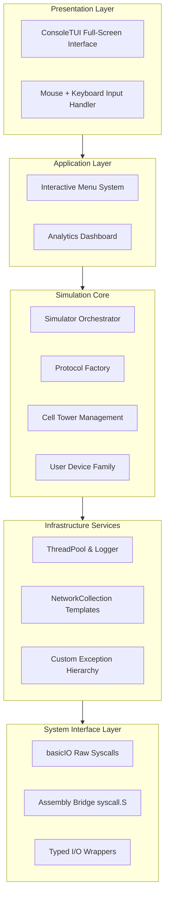
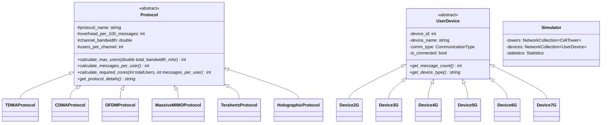

<p align="center">
  
  
  
</p>

<h1 align="center">
  Cellular Network Simulator
</h1>

<p align="center">
  <strong>A Comprehensive Simulation Framework for 2G–7G Cellular Networks</strong>
</p>

<p align="center">
  <video src="https://github.com/Necromancer0912/heterogeneous-cellular-network-simulator/raw/main/live_demo.mp4" width="850" controls autoplay loop muted></video>
</p>

---

<details>
<summary><strong>Quick Navigation</strong></summary>

| Section | Description |
| :--- | :--- |
| [Executive Summary](#executive-summary) | High-level project overview |
| [Authors](#authors) | Contributors and contact |
| [Feature Implementation Matrix](#feature-implementation-matrix) | Implemented features and requirements |
| [System Architecture](#system-architecture) | Design patterns and diagrams |
| [Component Deep Dive](#component-deep-dive) | Detailed class catalogue |
| [Cellular Generation Specifications](#cellular-generation-specifications) | 2G–7G technical details |
| [Simulation CLI Guide](#simulation--cli-guide) | How to use the simulator |
| [Build, Run, and Test](#build-run-and-test) | Compilation instructions |
| [Analytics and Visualization](#analytics-and-visualization) | Performance tools and reports |
| [Project Structure](#project-structure) | File organization |
| [Future Enhancements](#future-enhancements) | Extension possibilities and roadmap |

</details>

---

## Authors

- **Sayan Das** - [sayan25041@iiitd.ac.in](mailto:sayan25041@iiitd.ac.in)
- **Senjuti Ghosal** - [senjutig2002@gmail.com](mailto:senjutig2002@gmail.com)

---

## Executive Summary

This repository presents a **production-grade Cellular Network Simulator** engineered to model the complete evolution of mobile communication technologies from **2G (GSM/TDMA)** through speculative **7G (Holographic)** systems. The project serves as:

1. **Software Engineering Showcase** — Demonstrating mastery of modern C++ principles including inheritance hierarchies, runtime polymorphism, template metaprogramming, RAII-based resource management, and exception safety.
2. **Research Sandbox** — Providing an extensible platform for capacity planning experiments, protocol comparisons, and concurrency benchmarking under realistic network workloads.

### Key Highlights

| Feature | Description |
| :--- | :--- |
| **Architecture & System Design** | Robust implementations of modular design, inheritance, polymorphism, and abstraction. |
| **Template Programming** | `NetworkCollection<T>` for type-safe storage and generic network element processing. |
| **Exception Handling** | Custom hierarchy (`CapacityException`, `ProtocolException`, etc.) for runtime error isolation. |
| **Concurrency Support** | ThreadPool task runner, atomic statistics, and async I/O using `std::future`. |
| **Zero-Overhead I/O** | Direct syscall interface via NASM assembly replacing traditional heavy I/O streams. |
| **6 Protocol Implementations** | Realistic mapping of TDMA, CDMA, OFDM, MIMO, THz, and Holographic protocols. |
| **Advanced Analytics** | Real-time QoS metrics, KPIs, interference modeling, and capacity forecasting. |
| **Full-Screen TUI** | Modern terminal interface with mouse support, sparkline charts, toast notifications, and 7 navigable tabs. |
| **Mobility Simulation** | Stochastic device movement with proximity-based handovers and 2D topology visualization. |
| **Dual-Mode Build System** | Streamlined compilation for Debug (`-g -O0`) and Release (`-O3 -march=native`) targets. |

---

## Feature Implementation Matrix

| Module / Requirement | Status | Implementation Files |
| :--- | :--- | :--- |
| **Simulation Framework**<br/>*User Device, Cell Tower, Cellular Core* | Complete | [UserDevice.h](include/UserDevice.h)<br/>[CellTower.h](include/CellTower.h)<br/>[CellularCore.h](include/CellularCore.h)<br/>[Simulator.h](include/Simulator.h) |
| **Protocol-Driven Overhead**<br/>*Message limits per 100 msgs* | Complete | [Protocol.h](include/Protocol.h) (abstract base)<br/>[Protocol.cpp](src/Protocol.cpp) (6 implementations) |
| **Frequency Allocation**<br/>*Channel occupancy tracking* | Complete | `CellTower::initialize_channels()` in [CellTower.cpp](src/CellTower.cpp)<br/>`CellTower::get_users_on_first_channel()` in [CellTower.cpp](src/CellTower.cpp) |
| **2G Analysis**<br/>*TDMA, 16 users/200kHz* | Complete | `Simulator::analyze2G()` in [Simulator.cpp](src/Simulator.cpp) |
| **3G Analysis**<br/>*CDMA, 32 users/200kHz* | Complete | `Simulator::analyze3G()` in [Simulator.cpp](src/Simulator.cpp) |
| **4G Analysis**<br/>*OFDM, 30 users/10kHz, 4 antennas* | Complete | `Simulator::analyze4G()` in [Simulator.cpp](src/Simulator.cpp) |
| **5G Analysis**<br/>*Massive MIMO, 16 antennas, dual-band* | Complete | `Simulator::analyze5G()` in [Simulator.cpp](src/Simulator.cpp) |
| **Architecture Foundations**<br/>*Abstraction, Encapsulation, Polymorphism* | Complete | Encapsulated core classes, polymorphic protocols, and devices |
| **Generic Templates** | Complete | `NetworkCollection<T>` in [Simulator.h](include/Simulator.h) |
| **Exception Handling** | Complete | Custom classes defined in [Exceptions.h](include/Exceptions.h) |
| **Build Configuration**<br/>*Debug + Release* | Complete | [Makefile](Makefile) supporting multi-profile compilation |

---

## System Architecture

### Layered Architecture



### Class Hierarchy



---

## Component Deep Dive

### Protocol Hierarchy

`Protocol` acts as the abstract base class specifying interfaces for calculations based on generation limits.

<details>
<summary><strong>Protocol.h - Abstract Base Interface</strong></summary>

```cpp
/**
 * Abstract base class for communication protocols
 * Demonstrates polymorphism and data abstraction
 */
class Protocol {
protected:
    std::string protocol_name;
    int overhead_per_100_messages;
    double channel_bandwidth;      // in kHz
    int users_per_channel;

public:
    Protocol(const std::string &name, int overhead, double bandwidth, int users);
    virtual ~Protocol();

    // Pure virtual methods — MUST be overridden
    virtual int calculate_max_users(double total_bandwidth_mhz) const = 0;
    virtual int calculate_messages_per_user() const = 0;
    virtual int calculate_required_cores(int totalUsers, int messages_per_user) const = 0;
    virtual std::string get_protocol_details() const = 0;

    // Getters
    std::string get_protocol_name() const { return protocol_name; }
    int get_overhead() const { return overhead_per_100_messages; }
    double get_channel_bandwidth() const { return channel_bandwidth; }
    int get_users_per_channel() const { return users_per_channel; }
};
```

</details>

#### Concrete Protocol Configurations

| Protocol | Class | Channel BW | Users/Channel | Antennas | Special Features |
| :--- | :--- | :--- | :--- | :--- | :--- |
| **2G** | `TDMAProtocol` | 200 kHz | 16 | 1 | Circuit + packet switching |
| **3G** | `CDMAProtocol` | 200 kHz | 32 | 1 | Code division multiplexing |
| **4G** | `OFDMProtocol` | 10 kHz | 30 | 4 | MIMO channel reuse |
| **5G** | `MassiveMIMOProtocol` | 10 kHz | 30 | 16 | Dual-band (1800 MHz) support |
| **6G** | `TerahertzProtocol` | 1 MHz | 50 | 64 | AI beamforming, quantum encryption |
| **7G** | `HolographicProtocol` | 10 MHz | 100 | 128 | Satellite mesh, brain interface |

---

### Device Hierarchy

`UserDevice` represents user hardware configurations connecting to tower resources.

<details>
<summary><strong>UserDevice.h - Base Device Class</strong></summary>

```cpp
/**
 * Enumeration for device communication types
 */
enum class CommunicationType {
    DATA,
    VOICE,
    BOTH
};

/**
 * Base class representing a user device in the cellular network
 * Demonstrates data abstraction and encapsulation
 */
class UserDevice {
private:
    static int device_counter;         // Class-level counter
    int device_id;
    std::string device_name;
    CommunicationType comm_type;
    bool is_connected;
    int assigned_channel;
    int assigned_antenna;

public:
    // Virtual methods for polymorphism
    virtual int get_message_count() const = 0;
    virtual std::string get_device_type() const = 0;

    // Static method — demonstrates class-level behavior
    static int get_total_devices() { return device_counter; }
};
```

</details>

#### Device Message Load Profiles

| Device Type | Messages (DATA) | Messages (VOICE) | Messages (BOTH) |
| :--- | :--- | :--- | :--- |
| `Device2G` | 5 | 15 | 20 |
| `Device3G` | 10 | 10 | 10 |
| `Device4G` | 10 | 10 | 10 |
| `Device5G` | 10 | 10 | 10 |
| `Device6G` | 8 | 8 | 8 |
| `Device7G` | 6 | 6 | 6 |

---

### Cell Tower Architecture

`CellTower` models the physical cells allocating bandwidth channels dynamically and handling beamforming scaling factors.

<details>
<summary><strong>CellTower.h - Tower Resource Management</strong></summary>

```cpp
/**
 * Frequency Channel structure to track users per frequency
 */
struct FrequencyChannel {
    int channel_id;
    double start_frequency;      // in kHz
    double end_frequency;        // in kHz
    int max_users;
    std::vector<std::shared_ptr<UserDevice>> connected_devices;
    int antenna_id;              // For MIMO systems

    FrequencyChannel(int id, double start, double end, int max, int antenna = 0);
    bool is_full() const;
    int get_available_slots() const;
};

/**
 * Cell Tower class that manages user devices and frequency allocation
 * Demonstrates composition and aggregation
 */
class CellTower {
private:
    static int tower_counter;
    int tower_id;
    std::string location;
    std::shared_ptr<Protocol> protocol;
    std::vector<std::shared_ptr<CellularCore>> cores;
    std::vector<FrequencyChannel> channels;
    std::map<int, std::shared_ptr<UserDevice>> connected_devices;
    double total_bandwidth_mhz;
    int max_supported_devices;
    double beamforming_multiplier;
    mutable std::mutex tower_mutex;  // Thread safety

    void initialize_channels();
    int find_available_channel() const;

public:
    // Device management
    bool connect_device(std::shared_ptr<UserDevice> device);
    bool disconnect_device(int device_id);

    // Channel queries
    std::vector<std::shared_ptr<UserDevice>> get_users_on_first_channel() const;
    void display_first_channel_users() const;

    // Beamforming
    void apply_beamforming(double factor);
    void disable_beamforming();
};
```

</details>

---

### Generic Template Container

`NetworkCollection<T>` provides type-safe abstraction over STL vectors, handling ownership and memory constraints of cellular infrastructure objects.

<details>
<summary><strong>NetworkCollection Template</strong></summary>

```cpp
/**
 * Template class for managing collections of network elements
 * Demonstrates C++ template programming
 */
template <typename T>
class NetworkCollection {
private:
    std::vector<std::shared_ptr<T>> elements;
    std::string collection_name;

public:
    NetworkCollection(const std::string &name) : collection_name(name) {}

    void add(std::shared_ptr<T> element) {
        elements.push_back(element);
    }

    void remove(int index) {
        if (index >= 0 && index < elements.size()) {
            elements.erase(elements.begin() + index);
        }
    }

    std::shared_ptr<T> get(int index) const {
        if (index >= 0 && static_cast<size_t>(index) < elements.size()) {
            return elements[index];
        }
        return nullptr;
    }

    int size() const { return elements.size(); }
    std::vector<std::shared_ptr<T>> get_all() const { return elements; }
    void clear() { elements.clear(); }
    std::string get_name() const { return collection_name; }
};
```

</details>

---

### Exception Safety

The simulator enforces structural integrity using isolated error catch paths.

<details>
<summary><strong>Exceptions.h - Exception Hierarchy</strong></summary>

```cpp
/**
 * Base exception class for cellular network errors
 */
class CellularNetworkException : public std::exception {
protected:
    std::string message;
public:
    explicit CellularNetworkException(const std::string& msg) : message(msg) {}
    const char* what() const noexcept override { return message.c_str(); }
};

/**
 * Thrown when tower/core capacity is exceeded
 */
class CapacityException : public CellularNetworkException {
public:
    explicit CapacityException(const std::string& msg)
        : CellularNetworkException("Capacity Error: " + msg) {}
};

/**
 * Thrown for protocol-related errors
 */
class ProtocolException : public CellularNetworkException {
public:
    explicit ProtocolException(const std::string& msg)
        : CellularNetworkException("Protocol Error: " + msg) {}
};

/**
 * Thrown for invalid configurations
 */
class ConfigurationException : public CellularNetworkException {
public:
    explicit ConfigurationException(const std::string& msg)
        : CellularNetworkException("Configuration Error: " + msg) {}
};
```

</details>

---

### Concurrency Framework

The multithreaded simulation driver relies on a `ThreadPool` executing connection tasks concurrently and updating thread-safe status structures.

<details>
<summary><strong>Utils.h - ThreadPool Interface</strong></summary>

```cpp
/**
 * Thread Pool for parallel task execution
 * Uses producer-consumer pattern with condition variables
 */
class ThreadPool {
private:
    std::vector<std::thread> workers;
    std::queue<std::function<void()>> tasks;
    std::mutex queueMutex;
    std::condition_variable condition;
    std::atomic<bool> stop;

public:
    explicit ThreadPool(size_t numThreads);
    ~ThreadPool();

    template <class F, class... Args>
    auto enqueue(F &&f, Args &&...args)
        -> std::future<typename std::result_of<F(Args...)>::type>;

    size_t size() const { return workers.size(); }
};
```

</details>

---

## Cellular Generation Specifications

### 2G (GSM/TDMA)

| Parameter | Value |
| :--- | :--- |
| **Technology** | Time Division Multiple Access (TDMA) |
| **Switching** | Circuit (voice) + Packet (data) |
| **Channel Width** | 200 kHz |
| **Users/Channel** | 16 |
| **Spectrum Allocation** | 1 MHz |
| **Data Messages** | 5 per connection |
| **Voice Messages** | 15 per connection |
| **Total Messages** | 20 messages/device |
| **Available Channels** | 5 (1 MHz / 200 kHz) |
| **Maximum Users** | 80 (5 channels * 16 users) |

---

### 3G (UMTS/CDMA)

| Parameter | Value |
| :--- | :--- |
| **Technology** | Code Division Multiple Access (CDMA) |
| **Switching** | Packet (voice + data unified) |
| **Channel Width** | 200 kHz |
| **Users/Channel** | 32 |
| **Spectrum Allocation** | 1 MHz |
| **Total Messages** | 10 per device |
| **Available Channels** | 5 (1 MHz / 200 kHz) |
| **Maximum Users** | 160 (5 channels * 32 users) |
| **Capacity vs 2G** | 2.0x increase |

---

### 4G (LTE/OFDM)

| Parameter | Value |
| :--- | :--- |
| **Technology** | Orthogonal Frequency Division Multiplexing (OFDM) |
| **Channel Width** | 10 kHz (sub-channels) |
| **Users/Channel** | 30 |
| **MIMO Antennas** | 4 (parallel streams) |
| **Spectrum Allocation** | 1 MHz |
| **Total Messages** | 10 per device |
| **Sub-channels** | 100 (1 MHz / 10 kHz) |
| **Base User Capacity** | 3,000 (100 sub-channels * 30 users) |
| **MIMO Multiplier** | 12,000 users (with spatial reuse) |

---

### 5G (Massive MIMO)

| Parameter | Value |
| :--- | :--- |
| **Technology** | Massive MIMO with High-Frequency Support |
| **Base Band** | Standard (inherits 4G sub-channeling) |
| **High-Frequency Band** | 10 MHz @ 1800 MHz |
| **Users/MHz (HF)** | 30 |
| **MIMO Antennas** | 16 (massive array) |
| **Base Band Capacity** | Inherits 4G capacity model |
| **High-Frequency Capacity** | 300 additional users |
| **MIMO Scaling Factor** | 16x antenna reuse potential |

---

### Futuristic Generations (6G & 7G)

| Parameter | 6G (Terahertz) | 7G (Holographic) |
| :--- | :--- | :--- |
| **Spectrum Band** | 300 GHz (Terahertz) | Space-Terrestrial Optical |
| **Antenna Array** | 64 (Ultra-Massive MIMO) | 128 (Extreme MIMO) |
| **Bandwidth** | 1 MHz per channel | 10 MHz per channel |
| **Users/Channel** | 50 | 100 |
| **Key Enablers** | AI Beamforming, Quantum Cryptography | Satellite Mesh, Brain-Computer Interface |

---

## Terminal User Interface

### Full-Screen TUI

The simulator launches a modern, full-screen terminal UI (inspired by btop/htop) with mouse support, live-updating dashboards, and 7 navigable tabs.

```
╭─────────────────────────────────────────────────────────────────────────╮
│ ⚡ CELLULAR SIMULATOR  [1] Dashboard  [2] Towers  [3] Devices  ...     │
╰─────────────────────────────────────────────────────────────────────────╯
```

### Tab Overview

| Tab | Key | Description |
| :--- | :--- | :--- |
| **Dashboard** | `1` | Live throughput graph (auto-scaled, resets dynamically on resets/scenario loads to prevent flatlining), network stats cards, and scrolling event log |
| **Towers** | `2` | Tower list with keyboard navigation, detailed tower view with core utilization bars |
| **Devices** | `3` | Sortable device table with `/` search/filter, scrollable with mouse wheel |
| **Analytics** | `4` | Generation comparison with horizontal bar charts, tower health monitor, network KPIs |
| **Visual Map** | `5` | 2D spatial map (1000m x 1000m) with spiral collision resolution (nodes never overlap), selective signal path highlighting on node selection, and live anims of active packets (`✦`/`◆`) |
| **Actions** | `6` | Interactive action list (keyboard + mouse navigable), quick stats sidebar |
| **Help** | `7` | Hotkey reference and console command documentation |

### Navigation

| Input | Action |
| :--- | :--- |
| `1-7` | Switch tabs directly |
| `Up/Down` | Navigate lists and select items |
| `Enter` | Execute selected action (Actions tab) |
| `B/b` | Toggle beamforming on selected tower |
| `C/c` | Toggle Keyboard Cursor Mode (Visual Map tab) |
| `WASD / Arrows` | Move blinking keyboard cursor (Visual Map cursor mode) |
| `Space / Enter` | Toggle building obstacle `█` at cursor (Visual Map cursor mode) |
| `/` | Activate device search filter |
| `:` | Open command console with auto-complete |
| `Esc` | Cancel current mode or clear active selection |
| `Q/q` | Exit simulator |
| **Mouse Click** | Click tabs, list items, action items, or click directly on Map elements (Core, Towers, Devices) to inspect them. Clicks on empty map space clear selection. Supports both standard X10 (`\033[M`) and SGR (`\033[<`) mouse formats. |
| **Mouse Scroll** | Scroll device list |

### Console Commands

Press `:` to open the interactive command console with Tab auto-completion:

```
> spike              Trigger traffic fluctuations
> scenario urban     Load predefined network scenario
> addtower 5G Downtown 20.0 4    Deploy a custom tower
> adddevice 5G Phone both 0      Register a new device
> beamforming 0 2.5  Apply 2.5x beamforming to tower 0
> handovers 10       Simulate 10 random handovers
> reset              Reset all configurations
> tab 3              Switch to Devices tab
```

---

## Build, Run, and Test

### Prerequisites

| Tool | Minimum Version | Purpose |
| :--- | :--- | :--- |
| **GCC/G++** | 7.0+ | C++17 compilation |
| **NASM** | 2.14+ | Low-level assembly syscall assembly |
| **GNU Make** | 4.0+ | Build automation |
| **Linux/WSL** | Any | POSIX architecture interface support |

### Build Commands

```bash
# Clean previous build artifacts
make clean

# Compile release and debug versions
make all

# Compile optimized release version only
make release

# Compile debug version with symbols
make debug
```

### Execution

```bash
# Execute optimized release version
make run

# Execute debug version
make run-debug
```

### Testing

```bash
# Build and run all automated unit tests
make test
```

---

## Analytics and Visualization

### Performance Report

```
Performance Metrics:
 Total Towers Deployed: 15
 Total Connected Devices: 1898
 Network Protocols: 4G (3 towers), 5G (12 towers)
 Total Bandwidth Allocated: 575 MHz
 Total Processing Cores: 165

Load Distribution Analysis:
 Low Load (0-25%):     4 towers - Excellent capacity
 Medium Load (25-50%): 3 towers - Good performance
 High Load (50-75%):    3 towers - Monitor closely
 Very High (75-90%):   3 towers - Consider expansion
 Critical (90-100%):   2 towers - Immediate action needed
```

### Tower Utilization Graph

```
Tower   Utilization Bar                       Percentage Status
0       [██░░░░░░░░░░░░░░░░░░░]               20%        Normal
1       [████░░░░░░░░░░░░░░░░░]               40%        Normal
2       [██████░░░░░░░░░░░░░░]                60%        Normal
3       [████████░░░░░░░░░░░░]                80%        High Load
4       [████████████████████]                98%        Critical
```

### Network Topology Visualization

```
+ Tower #0 [Rural-Empty]
  ├─ Protocol: 4G (OFDM)
  ├─ Cores: 5
  ├─ Capacity: 0/120 users
  ├─ Utilization: 0.0% (Normal)
  └─ No connected devices

+ Tower #1 [Suburban-1]
  ├─ Protocol: 4G (OFDM)
  ├─ Cores: 8
  ├─ Capacity: 48/240 users
  ├─ Utilization: 20.0% (Normal)
  └─ Connected Devices: Sub-1-1, Sub-1-2, Sub-1-3, Sub-1-4, Sub-1-5 ... +43 more

+ Tower #2 [Downtown-5G]
  ├─ Protocol: 5G (Massive MIMO)
  ├─ Cores: 12
  ├─ Capacity: 456/480 users
  ├─ Utilization: 95.0% (Critical)
  ├─ Beamforming: Active (factor: 1.25)
  └─ Connected Devices: Downtown-1, Downtown-2, Downtown-3, Downtown-4, Downtown-5 ... +451 more
```

### Generation Comparison Table

| Generation | Max Users | Messages/User | Cores | Efficiency (Users/Core) |
| :--- | :--- | :--- | :--- | :--- |
| **2G** | 80 | 20 | 2 | 40 |
| **3G** | 160 | 10 | 2 | 80 |
| **4G** | 12,000 | 10 | 12 | 1,000 |
| **5G** | 48,300 | 10 | 50 | 966 |
| **6G** | 320,000 | 8 | 256 | 1,250 |
| **7G** | 1,280,000 | 6 | 768 | 1,667 |

---

## Project Structure

```
cellular-network-simulator/
├── Makefile                          # Build configuration (debug + release)
├── README.md                         # Project documentation
│
├── include/                          # Header files
│   ├── AdvancedMetrics.h             # QoS, KPIs, forecasting
│   ├── basicIO.h                     # Low-level syscall I/O
│   ├── BlockStandardIO.h             # iostream blocking guard
│   ├── CellTower.h                   # Tower + FrequencyChannel
│   ├── CellularCore.h                # Core resource management
│   ├── ConsoleTUI.h                 # Full-screen TUI interface
│   ├── Exceptions.h                  # Custom exception hierarchy
│   ├── IOHelpers.h                   # Typed I/O wrappers
│   ├── NetworkAnalytics.h            # Analytics + LoadBalancer + Handover
│   ├── Protocol.h                    # Abstract protocol base + 6 implementations
│   ├── Simulator.h                   # Main orchestrator + NetworkCollection<T>
│   ├── UserDevice.h                  # Device base + 6 implementations
│   └── Utils.h                       # ThreadPool, Logger, OutputFormatter
│
├── src/                              # Implementation files
│   ├── AdvancedMetrics.cpp           # Metrics calculations
│   ├── basicIO.cpp                   # Syscall wrappers
│   ├── CellTower.cpp                 # Tower logic
│   ├── CellularCore.cpp              # Core logic
│   ├── ConsoleTUI.cpp                # Full-screen TUI rendering + input handling
│   ├── IOHelpers.cpp                 # I/O helper implementations
│   ├── main.cpp                      # Entry point + TUI launcher
│   ├── NetworkAnalytics.cpp          # Analytics implementations
│   ├── Protocol.cpp                  # Protocol implementations
│   ├── Simulator.cpp                 # Simulator orchestration
│   ├── syscall.S                     # Assembly syscall bridge
│   ├── UserDevice.cpp                # Device implementations
│   └── Utils.cpp                     # Utility implementations
│
└── tests/                            # Unit tests
    ├── test_concurrency.cpp          # ThreadPool tests
    ├── test_exceptions.cpp           # Exception handling tests
    ├── test_protocol_core.cpp        # Protocol + Core tests
    └── test_stubs.cpp                # Test infrastructure stubs
```

---

## Future Enhancements

### Roadmap

| Priority | Enhancement | Status | Description |
| :--- | :--- | :--- | :--- |
| **High** | **Mobility Simulation** | Done | Stochastic random-walk movement with proximity-based handovers |
| **High** | **TUI Dashboard** | Done | Full-screen terminal UI with mouse support, sparkline charts, and 7 tabs |
| **High** | **Toast Notifications** | Done | Non-intrusive notification system for action feedback |
| **Medium** | **ML Optimization** | Planned | Train models on `PerformanceMetrics` to predict overload and recommend beamforming |
| **Medium** | **Traffic Replay** | Planned | Import CSV traces to replay actual user arrival/departure patterns |
| **Low** | **Distributed Simulation** | Planned | Multi-process architecture using ZeroMQ/gRPC for edge coordination studies |
| **Low** | **5G NR Features** | Planned | Network slicing, edge computing integration |

### Extension Points

Adding a new protocol (e.g., 8G):

```cpp
class QuantumProtocol : public Protocol {
public:
    QuantumProtocol() : Protocol("8G", 2, 100000.0, 1000) {
        // 100 MHz channels, 1000 users/channel
    }

    int calculate_max_users(double total_bandwidth_mhz) const override {
        // Custom quantum entanglement-based allocation
        return static_cast<int>(total_bandwidth_mhz * 10 * users_per_channel * 256);
    }

    // ... other overrides
};

// Register in Simulator::initialize_protocols()
available_protocols["8G"] = std::make_shared<QuantumProtocol>();
```

---

## Licensing & References

### Attribution & Inspiration

- **basicIO syscall pattern**: Adapted from conceptual operating systems architecture descriptions (Silberschatz, Tanenbaum) for raw assembly-based deterministic I/O.
- **Box-drawing characters**: Standard Unicode characters used for console layout.
- **ThreadPool pattern**: Inspired by task-queuing models in C++ concurrency reference patterns.

### Contact

- **Sayan Das** - [sayan25041@iiitd.ac.in](mailto:sayan25041@iiitd.ac.in)
- **Senjuti Ghosal** - [senjutig2002@gmail.com](mailto:senjutig2002@gmail.com)
